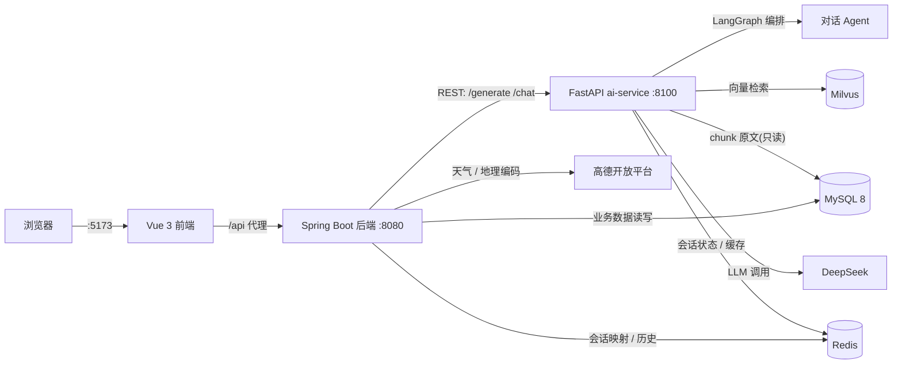

<div align="center">

# 智旅云图

**表单 + 对话 双模式的 AI 行程规划系统**

填好出发地、目的地、天数与偏好,或直接和 AI 聊几句,即可生成一份结构化的多日行程 —— 逐日景点、餐饮住宿、交通、预算明细,一应俱全。

</div>

---

## 界面预览

**规划页 · 表单式** —— 填写目的地、日期、人数与旅行偏好,提交后由 AI 生成行程

<p align="center">
  
</p>

**规划页 · 对话式** —— 用自然语言描述需求,AI 边聊边整理参数,点「确认行程」生成

<p align="center">
  
</p>

**结果页 · 行程总览** —— 概览信息 + 预算明细 + 逐日安排

<p align="center">
  
</p>

**结果页 · 地图路线与景点图鉴** —— 高德地图标注景点位置与行进路线,下方按天列出景点卡片

<p align="center">
  
</p>

**结果页 · 逐日详情** —— 每天的景点安排、餐饮住宿、交通与预算

<p align="center">
  
</p>

---

## 项目简介

智旅云图提供两种互斥的规划入口,产物统一为同一套行程模型(TripPlan),后续的保存、查看历史走同一套流程。

| 模式 | 交互方式 | 适用场景 |
|---|---|---|
| **表单式** | 填固定表单(出发地/目的地/日期/偏好/预算)后生成 | 目标明确,想快速出结果 |
| **对话式** | 与 AI Agent 多轮对话,补齐参数后确认生成 | 需求零散,边聊边想 |

后端只负责业务(认证、行程 CRUD、导出、天气、路由),所有 AI 能力(对话 Agent、RAG 检索、LLM 生成)集中在独立的 Python 服务中,两者通过 REST 通信。

## 核心功能

- **对话式规划 Agent** —— 基于 LangGraph 编排。supervisor 先把用户这句话判定为 7 类意图之一(闲聊 / 攻略 / 天气 / 预算 / 收集参数 / 生成行程 / 修改行程),再路由到对应专家节点;参数不全时自动转为「收集参数」追问,避免答非所问。
- **生成自检闭环** —— 生成阶段由 planner → critic → reviser 三段式完成:先生成初步行程,再由 critic 打分挑毛病,最后由 reviser 定点修改,提升输出质量。
- **RAG 攻略检索** —— 内置大理、成都、西安三城旅游指南,切块后向量化存进 Milvus;对话与生成时检索相关段落,让回答与行程有据可依。
- **真实天气接入** —— 通过高德开放平台获取目的地天气,出行临近时把天气注入行程建议。
- **结果可视化** —— 高德地图标注景点与路线、景点图鉴卡片、逐日详情、预算明细。
- **历史记录** —— 生成的行程可保存并在「历史」中回看。

## 系统架构



| 服务 | 技术栈 | 职责 |
|---|---|---|
| `frontend/` | Vue 3 + Vite + TypeScript | 页面与交互:规划、结果、历史;`/api` 代理到后端 |
| `backend/` | Spring Boot 4 + Java 17 | 所有业务:认证(JWT)、行程 CRUD、导出、天气、路由 |
| `ai-service/` | Python FastAPI + LangGraph + LangChain | 所有 AI:对话 Agent、RAG、LLM 生成、结构化行程输出 |
| MySQL 8 | — | 唯一业务库,只有后端写库;AI 服务只读 RAG 原文 |
| Redis | — | 会话状态(LangGraph checkpointer)、缓存 |
| Milvus | — | 只存文本向量 + chunk_id,用于 RAG 召回 |

## 技术栈

| 层 | 版本 / 组件 |
|---|---|
| 前端 | Vue 3 · Vite 6 · TypeScript 5 · axios |
| 后端 | Spring Boot 4 · Java 17 · Spring Security(JWT)· JPA · Spring Data Redis |
| AI 服务 | Python 3.11+ · FastAPI · LangGraph · LangChain · DeepSeek |
| 存储 | MySQL 8 · Redis · Milvus |
| 地图与天气 | 高德开放平台(Web 服务 + JS API) |

## 快速开始

### 环境要求

| 依赖 | 说明 |
|---|---|
| JDK 17+ | 运行后端 |
| Node.js 18+ | 运行前端 |
| Python 3.11+ | 运行 AI 服务 |
| MySQL 8 | 业务库,需先建库 `zhilv` |
| Redis | 会话与缓存,默认 `localhost:6379` |
| Docker | 用于一键拉起 Milvus(自带 etcd + minio) |

### 步骤 1 · 启动依赖服务

```bash
# Milvus 向量库(在 deploy/milvus 下,含 etcd、minio 两个依赖容器)
cd deploy/milvus && docker compose up -d
```

MySQL 8 与 Redis 请自行准备并保持运行(默认端口 `3306` / `6379`)。首次使用需创建数据库:

```sql
CREATE DATABASE IF NOT EXISTS zhilv DEFAULT CHARACTER SET utf8mb4;
```

> 表结构由后端启动时自动建(JPA `ddl-auto=update`),不需要手动建表。

### 步骤 2 · 启动 AI 服务(ai-service)

```bash
cd ai-service
python -m venv .venv

# 安装依赖(Windows)
./.venv/Scripts/pip install -r requirements.txt
# macOS / Linux 用: ./.venv/bin/pip install -r requirements.txt

# 准备配置:复制模板并填写密钥
cp .env.example .env
```

编辑 `ai-service/.env`,至少填好这几项:

```
LLM_API_KEY=            # DeepSeek(或兼容接口)的 key
LLM_BASE_URL=           # 接口地址
EMBEDDING_API_KEY=      # 向量化服务 key(SiliconFlow,用于 RAG)
AI_SERVICE_KEY=         # 内部调用密钥,必须与后端 AI_SERVICE_KEY 一致
MYSQL_PASSWORD=         # 本地 MySQL 密码
```

先把内置攻略指南切块入库(RAG 用,可重复执行,幂等):

```bash
./.venv/Scripts/python -m app.rag.ingest
```

启动服务:

```bash
./.venv/Scripts/python -m uvicorn app.main:app --reload --port 8100
```

健康检查:`curl http://127.0.0.1:8100/health`

### 步骤 3 · 启动后端(backend)

后端密钥一律走环境变量,不写死在配置里。运行前先设置(值换成你自己的):

Windows(命令行,设置后需重开终端):

```bat
setx JWT_SECRET "your-32-chars-or-longer-secret"
setx AI_SERVICE_KEY "your-shared-internal-key"
setx DB_PASSWORD "your-mysql-password"
setx AMAP_API_KEY "your-amap-web-service-key"
```

macOS / Linux:

```bash
export JWT_SECRET="your-32-chars-or-longer-secret"
export AI_SERVICE_KEY="your-shared-internal-key"
export DB_PASSWORD="your-mysql-password"
export AMAP_API_KEY="your-amap-web-service-key"
```

启动:

```bash
cd backend && ./mvnw spring-boot:run
```

后端默认监听 `http://localhost:8080`。

### 步骤 4 · 启动前端(frontend)

```bash
cd frontend
npm install
```

在 `frontend/` 下新建 `.env`(高德 JS API key,用于地图):

```
VITE_AMAP_JS_KEY=your-amap-js-key
VITE_AMAP_SECURITY_CODE=your-amap-js-security-code
```

启动:

```bash
npm run dev
```

浏览器打开 **http://localhost:5173**,注册账号后即可使用。

## 环境变量速查

### backend

| 变量 | 必填 | 说明 |
|---|---|---|
| `JWT_SECRET` | 是 | JWT 签名密钥,≥ 32 字符 |
| `AI_SERVICE_KEY` | 是 | 与 `ai-service/.env` 中同名变量完全一致 |
| `DB_PASSWORD` | 是 | 本地 MySQL 密码 |
| `AMAP_API_KEY` | 是 | 高德 Web 服务 key(天气 / 地理编码) |
| `DB_URL` / `DB_USERNAME` | 否 | 默认 `jdbc:mysql://localhost:3306/zhilv`,账号 `root` |
| `REDIS_HOST` / `REDIS_PORT` | 否 | 默认 `localhost:6379` |
| `AI_BASE_URL` | 否 | 默认 `http://localhost:8100` |

### ai-service(`.env`)

| 变量 | 说明 |
|---|---|
| `LLM_API_KEY` / `LLM_BASE_URL` / `LLM_MODEL` | 大模型接入(默认模型 `deepseek-v4-flash`) |
| `AI_SERVICE_KEY` | 内部调用密钥,需与后端一致 |
| `EMBEDDING_API_KEY` / `EMBEDDING_MODEL` / `EMBEDDING_BASE_URL` | RAG 向量化(默认 `BAAI/bge-m3`) |
| `MYSQL_HOST` / `MYSQL_PORT` / `MYSQL_DATABASE` / `MYSQL_USER` / `MYSQL_PASSWORD` | 读取 RAG 原文(只读) |
| `RAG_MILVUS_URI` | Milvus 地址,默认 `http://localhost:19530` |
| `RAG_TOP_K` | 检索返回条数,默认 `4` |

### frontend(`.env`)

| 变量 | 说明 |
|---|---|
| `VITE_AMAP_JS_KEY` / `VITE_AMAP_SECURITY_CODE` | 高德 JS API key(地图) |
| `VITE_API_BASE_URL` | 可选。留空则走 Vite 代理(`/api` → 后端) |

> **安全提醒**:上面所有真实密钥只写在各自的 `.env` 里,`.env` 已被 `.gitignore` 忽略,请勿提交到仓库。

## 使用说明

**表单式**:登录后进入「规划」页 → 切到「表单式」→ 填写出发城市、目的城市、起止日期、人数,以及节奏偏好(轻松 / 适中 / 紧凑)、住宿档次、预算、旅行偏好等 → 提交,稍候即可在「结果」页看到完整行程。

**对话式**:在「规划」页切到「对话式」→ 直接用自然语言描述(例如「从北京出发,带爸妈去大理玩 5 天,预算 8000」)→ AI 会边聊边把信息整理成参数(页面上的参数标签会实时更新)→ 参数齐备后点「确认行程」生成。

**查看与保存**:生成结果在「结果」页展示,包含行程总览、地图路线、景点图鉴、逐日详情与预算明细;保存后可在「历史」页回看。

## 目录结构

```
frontend/                 Vue 3 前端
  src/views/              Home(规划) / Result(结果) / History(历史) / Login
  src/components/         地图组件、对话面板
  src/services/           API 调用封装
backend/                  Spring Boot 后端
  src/main/java/com/zhilv/
    controller/           REST 接口
    service/              业务逻辑
    ai/                   调用 Python 服务的客户端
    config/               安全、JWT
    dto/ entity/          行程模型与实体
ai-service/               Python AI 服务
  app/graph/              LangGraph 编排(supervisor + 专家节点)
  app/agents/             各意图专家、planner / critic / reviser
  app/rag/                切块、向量化、检索、入库
  app/models/             行程与对话的 Pydantic 模型
  data/rag/               内置城市旅游指南(.md)
deploy/milvus/            Milvus 一键启动 compose
```

## 说明

- 本仓库为「智旅云图」的复现版本,融合自研项目「智旅助手」的 AI 能力,采用新架构实现。
- AI 相关逻辑全部位于 `ai-service/`;`backend/` 不写 LLM / RAG / Agent 代码。
- Python 服务不直接写业务库,只做「生成」与「对话」,持久化统一由后端完成。
